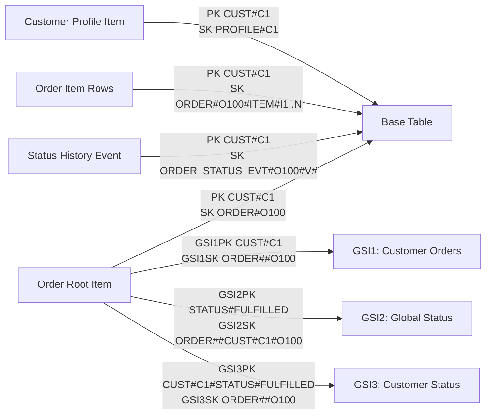

# DynamoDB Single Table Data Modelling Demo

This project demonstrates:
- testing DynamoDB code locally with Testcontainers
- modeling multiple entities in one table
- using separate GSIs for clear access patterns

## Quick start

Prerequisites:
- Java 17+
- Maven 3.9+
- Docker Desktop (or equivalent runtime)

Run:

```bash
mvn test
```

Notes:
- Testcontainers uses `amazon/dynamodb-local` during tests.
- Docker API compatibility is pinned with `docker.api.version=1.44`.
- Override if needed: `mvn -Ddocker.api.version=1.43 test`
- If Docker is unavailable, tests are skipped by `@Testcontainers(disabledWithoutDocker = true)`.

## Project map

- Single-table example:
  - `src/main/java/com/example/dynamodb/CommerceSingleTableRepository.java`
  - `src/test/java/com/example/dynamodb/CommerceSingleTableRepositoryIT.java`

## Single-table model

Domain entities:
- `CustomerProfile`
- `CustomerOrder`
- `OrderLineItem` (with `itemStatus`)

Base table (`commerce_single_table`) keys:
- Customer profile:
  - `PK = CUST#{customerId}`
  - `SK = PROFILE#{customerId}`
- Order root:
  - `PK = CUST#{customerId}`
  - `SK = ORDER#{orderId}`
- Order item:
  - `PK = CUST#{customerId}`
  - `SK = ORDER#{orderId}#ITEM#{itemId}`

GSIs:
- `gsi_customer_orders` (`GSI1PK`, `GSI1SK`)
  - customer timeline
  - `GSI1PK = CUST#{customerId}`
  - `GSI1SK = ORDER#{createdAt}#{orderId}`
- `gsi_status_orders` (`GSI2PK`, `GSI2SK`)
  - global status feed
  - `GSI2PK = STATUS#{status}`
  - `GSI2SK = ORDER#{createdAt}#CUST#{customerId}#{orderId}`
- `gsi_customer_status_orders` (`GSI3PK`, `GSI3SK`)
  - one customer + one status feed
  - `GSI3PK = CUST#{customerId}#STATUS#{status}`
  - `GSI3SK = ORDER#{createdAt}#{orderId}`

## Access patterns tested

| Access pattern | Repository method | Query shape | Index used | Test |
|---|---|---|---|---|
| Load one order aggregate (`order + items`) | `getOrderWithItems(customerId, orderId)` | `PK=:pk AND begins_with(SK,:prefix)` | Base table | `shouldLoadOrderAggregateFromSinglePartitionQuery` |
| Customer timeline (newest first) | `listOrdersForCustomerNewestFirst(customerId, limit)` | `GSI1PK=:pk`, desc sort, limit | `gsi_customer_orders` | `shouldQueryCustomerOrderTimelineFromGsi` |
| Global status feed (newest first) | `listOrdersByStatusNewestFirst(status, limit)` | `GSI2PK=:pk`, desc sort, limit | `gsi_status_orders` | `shouldQueryOrdersByStatusAcrossCustomersFromGsi` |
| Customer status feed (newest first) | `listOrdersForCustomerByStatusNewestFirst(customerId,status,limit)` | `GSI3PK=:pk`, desc sort, limit | `gsi_customer_status_orders` | `shouldQueryOrdersByStatusForSingleCustomerFromGsi` |
| Update order status and move status feeds | `updateOrderStatus(customerId,orderId,newStatus)` | `UpdateItem` on order root + rewritten GSI keys | GSI2 + GSI3 | `shouldUpdateOrderStatusAndMoveOrderAcrossStatusIndexes` |
| Update item status inside order | `updateOrderItemStatus(customerId,orderId,itemId,newStatus)` | `UpdateItem` on order-item row | Base table | `shouldUpdateItemStatusWithinOrder` |
| Append status history + optimistic lock | `updateOrderStatusWithHistory(...)` | `TransactWriteItems` (`Update` + event `Put`) with version condition | Base table + GSI2/GSI3 | `shouldAppendStatusHistoryAndIncrementVersionOnStatusUpdate`, `shouldRejectStaleVersionDuringOptimisticStatusUpdate` |

All tests are in `src/test/java/com/example/dynamodb/CommerceSingleTableRepositoryIT.java`.

## Read/write patterns and why efficient

These patterns use the current key model (`PK/SK`, `GSI1`, `GSI2`, `GSI3`) and are now covered by integration tests.

### Read patterns

| Access pattern | Repository method | Operation / key condition | Index | Why efficient | Test |
|---|---|---|---|---|---|
| Get customer profile by `customerId` | `getCustomerProfile(customerId)` | `GetItem(PK=CUST#{id}, SK=PROFILE#{id})` | Base table | Point read on full primary key (single-item lookup). | `shouldGetCustomerProfileByPrimaryKey` |
| Get one order header by `customerId + orderId` | `getOrderHeader(customerId,orderId)` | `GetItem(PK=CUST#{id}, SK=ORDER#{orderId})` | Base table | Point read on full primary key. | `shouldGetOrderHeaderByPrimaryKey` |
| Get one specific order item by `customerId + orderId + itemId` | `getOrderItem(customerId,orderId,itemId)` | `GetItem(PK=CUST#{id}, SK=ORDER#{orderId}#ITEM#{itemId})` | Base table | Point read on full primary key. | `shouldGetOrderItemByPrimaryKey` |
| List items for one order | `listOrderItems(customerId,orderId)` | `Query PK=:pk AND begins_with(SK, ORDER#{orderId}#ITEM#)` | Base table | Partition-local query with sort-key prefix; no scan/filter. | `shouldListOrderItemsForOneOrderByPrefixQuery` |
| Load order aggregate (`order + items`) | `getOrderWithItems(customerId,orderId)` | `PK=:pk AND begins_with(SK,:prefix)` | Base table | One partition-local query returns aggregate root + children. | `shouldLoadOrderAggregateFromSinglePartitionQuery` |
| List customer timeline (newest first) | `listOrdersForCustomerNewestFirst(customerId,limit)` | `Query GSI1PK=:pk`, desc sort, limit | `gsi_customer_orders` | Sparse index stores order roots only; avoids reading item rows. | `shouldQueryCustomerOrderTimelineFromGsi` |
| Paginate customer timeline | `listOrdersForCustomerNewestFirstPage(customerId,limit,token)` | `ExclusiveStartKey` + same GSI1 query | `gsi_customer_orders` | Keyset pagination keeps read cost bounded and stable per page. | `shouldPaginateCustomerTimelineUsingExclusiveStartKey` |
| List global orders for one status | `listOrdersByStatusNewestFirst(status,limit)` | `Query GSI2PK=:pk`, desc sort, limit | `gsi_status_orders` | Status bucket + time-ordered sort key; bounded reads with `limit`. | `shouldQueryOrdersByStatusAcrossCustomersFromGsi` |
| List customer orders for one status | `listOrdersForCustomerByStatusNewestFirst(customerId,status,limit)` | `Query GSI3PK=:pk`, desc sort, limit | `gsi_customer_status_orders` | Highly selective partition key (`customer + status`) plus time ordering. | `shouldQueryOrdersByStatusForSingleCustomerFromGsi` |
| List status change history for one order | `listOrderStatusHistoryNewestFirst(customerId,orderId,limit)` | `Query PK=:pk AND begins_with(SK, ORDER_STATUS_EVT#{orderId}#)` | Base table | Prefix query over immutable event rows; no scan/filter. | `shouldAppendStatusHistoryAndIncrementVersionOnStatusUpdate` |

### Write patterns

| Access pattern | Repository method | Operation shape | Keys/index impact | Why efficient | Test |
|---|---|---|---|---|---|
| Upsert customer profile | `putCustomer(customer)` | `PutItem` on `PK/SK` profile row | Base table only | Single write by exact key. | `shouldUpsertCustomerProfileByExactKey` |
| Idempotent customer create | `putCustomerIfAbsent(customer)` | Conditional `PutItem` (`attribute_not_exists`) | Base table only | Duplicate prevention handled on write path without read-before-write race. | `shouldUseConditionalWriteForIdempotentCustomerCreate` |
| Create order root | `putOrder(order)` | `PutItem` on `PK=CUST#{id}, SK=ORDER#{orderId}` | Base + GSI1 + GSI2 + GSI3 | One row write; DynamoDB propagates to GSIs automatically. | `shouldQueryCustomerOrderTimelineFromGsi` |
| Add order line item | `putOrderItem(customerId,item)` | `PutItem` on item row key | Base table only | Single write; no secondary index fan-out in current model. | `shouldLoadOrderAggregateFromSinglePartitionQuery` |
| Update order status (state transition) | `updateOrderStatus(customerId,orderId,newStatus)` | `UpdateItem` on order root; rewrite `GSI2PK/SK`, `GSI3PK/SK` | Base + GSI2 + GSI3 | Single-row update moves order between status buckets without scans. | `shouldUpdateOrderStatusAndMoveOrderAcrossStatusIndexes` |
| Update status with history + lock | `updateOrderStatusWithHistory(customerId,orderId,newStatus,expectedVersion,...)` | Transactional `Update` + history `Put`, condition `version = expectedVersion` | Base + GSI2 + GSI3 | Atomic state+history write and optimistic lock prevents lost updates. | `shouldAppendStatusHistoryAndIncrementVersionOnStatusUpdate` |
| Reject stale status update | `updateOrderStatusWithHistory(...)` with old version | Transaction canceled by condition failure | Base + GSI2 + GSI3 | Fast conflict detection without read-modify-write races. | `shouldRejectStaleVersionDuringOptimisticStatusUpdate` |
| Update item status (partial fulfillment) | `updateOrderItemStatus(customerId,orderId,itemId,newStatus)` | `UpdateItem` on one item row | Base table only | Narrow, row-level mutation scoped to one item. | `shouldUpdateItemStatusWithinOrder` |
| Delete one order item | `deleteOrderItem(customerId,orderId,itemId)` | `DeleteItem` on item row key | Base table only | Exact-key delete. | `shouldDeleteOrderItemByPrimaryKey` |
| Atomic order root + items write | `createOrderWithItemsAtomic(order,items)` | `TransactWriteItems` with conditional puts | Base table (+ GSIs for order root) | All-or-nothing correctness for multi-row create flows. | `shouldCreateOrderAndItemsAtomically` |
| Atomic rollback on conflict | `createOrderWithItemsAtomic(order,items)` | Failing transaction due to existing key | Base table (+ GSIs for order root) | Prevents partial writes when one row conflicts. | `shouldRollbackAtomicCreateWhenAnyRowAlreadyExists` |

### Not efficient with current keys (would need new index)

- Query by `sku` across all customers/orders.
- Query by `itemStatus` across all customers/orders.
- Global date-range feed independent of status/customer.

## Status updates

Order-level status (`CustomerOrder.status`):
- Lifecycle used in this sample: `CREATED`, `AWAITING_PAYMENT`, `PAID`, `IN_FULFILLMENT`, `PARTIALLY_FULFILLED`, `FULFILLED`, `CANCELLED`, `REFUNDED`.
- Every order root row stores `version` (starts at `1`).
- `updateOrderStatusWithHistory(...)` performs one transaction:
  - update order root `status`, `version=version+1`, and status GSI keys (`GSI2PK/GSI2SK`, `GSI3PK/GSI3SK`)
  - append immutable history event row: `SK=ORDER_STATUS_EVT#{orderId}#V#{zeroPaddedVersion}`
- History rows are base-table only (no GSI attributes), so they do not pollute order feed indexes.
- Version segment is zero-padded so lexicographic sort order matches numeric version order.
- Optimistic locking uses a condition `version = expectedVersion`; stale writers are rejected.
- `updateOrderStatus(...)` is a convenience wrapper that reads current version and delegates to `updateOrderStatusWithHistory(...)`.

Item-level status (`OrderLineItem.itemStatus`):
- Stored per order item row.
- Update only that item row with `updateOrderItemStatus(...)`.
- This supports partial fulfillment in one order (for example, one item shipped, one still pending).


## Why this model is efficient

1. Query-first design: all supported reads use key-condition `Query`.
2. No scan-based access paths in repository methods.
3. Sort-key encoding provides natural newest-first ordering.
4. Query-side `limit` bounds read cost early.


## Key-map diagram


